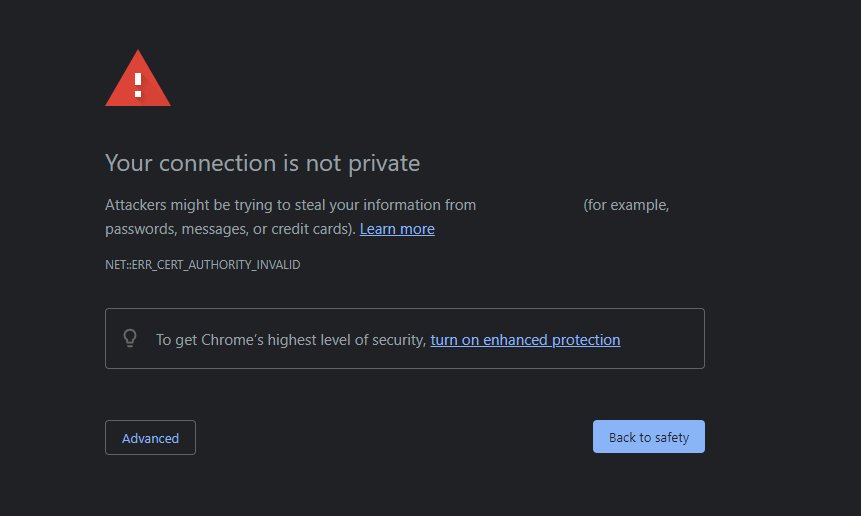

## Introduction and Information.

This tutorial will show you how to install [Kasm Workspaces](https://kasmweb.com/) with their official install script. I recommend you to install this on a clean, freshly installed server to avoid any problems.

**Disclaimers: I do not own Kasm Workspaces or this script, I don't take any responsibility for anything that happens to your server. Taking a backup is recommended, or just using a fresh system. This script is subject to change in the future by the Kasm Workspaces team, I will attempt to keep this up-to-date with the current changes.**

**Prerequisites**

* Root access to a server running Ubuntu 18.04, 20.04, 22,04 or Debian 9, 10, or 11. You can use ARM64 Virtual Machines or x86. There are other supported operating systems, but I will be using Ubuntu 22.04 in this tutorial.
   * You need port 80 and 443 open, using a reverse proxy is possible but not recommended.
* A CX21, CAX11, or CCX12 higher Hetzner Cloud server.
	* Any of Hetzner's Dedicated Server's should also work.
* If you want to add your own SSL certificates to replace self-signed; a domain with record access.
	* Must be pointed to your server before starting the tutorial.

## Step 1 - Downloading and installing Kasm.

SSH into your server and make sure you are the root user; if you are not run ``sudo -s``. Once you are in the root user, run this command.

```bash
cd /tmp && curl -O https://kasm-static-content.s3.amazonaws.com/kasm_release_1.13.1.421524.tar.gz && tar -xf kasm_release_1.13.1.421524.tar.gz && bash kasm_release/install.sh
```

## Step 1.1 - Agreeing to the EULA

You should see the EULA appear on your screen, something like this:


Read through it and type "y" then press enter to agree, if you don't agree please exit this guide. Kasm will begin to install.

## Step 2 - Testing it out!

You are pretty much done! Within your terminal, you should see something like this: 


Copy the Admin Kasm UI Login Credential and head to your server's ip in your browser with HTTPS, to do this take your server IP and add ``https://`` to the start, like ``https://1.1.1.1`` or ``https://%serverip%`` as an example. After you do that, you should see a screen like this:



Press "Advanced" then "Proceed to %serverip% (unsafe)". It is said to be unsafe due to the self-signed SSL certificates; but in-reality they are okay. Take the credentials provided in the terminal and log-in. Once you are logged in, head to the "Workspaces" tab and you're done! You can get to using your Kasm Workspaces instance.


## Step 3 - Setting up SSL with LetsEncrypt (optional)

After you've setup your Kasm Workspaces instance on Hetzner; you may want to remove the pesky unsafe warning to make it easier to use; it's easy! Here's how.

First off; you need to turn off Kasm so you can insert the SSL certificates, you could do that with this command:

```bash
/opt/kasm/bin/stop
```

Once you're done with that; install LetsEncrypt and head into the Kasm SSL certificate directory with this set of commands: 

```bash
apt -y install letsencrypt && cd /opt/kasm/current/certs
```

Once LetsEncrypt is installed, you need to create your SSL certificates, you could do that with this command: 

```bash
certbot certonly --standalone --agree-tos --preferred-challenges http -d example.com
```

Make sure to replace ``example.com`` with your domain-name that's pointed to your server. You should be asked for your email address, provide it, if you'd like to have your email shared; type "y", if not "n". Once your SSL certificates are created, make sure to backup your self-signed certificates in-case anything goes wrong; you can do that with:

```bash
mv kasm_nginx.crt kasm_nginx.crt.bk && mv kasm_nginx.key kasm_nginx.key.bk
```


Now, you need to setup symlinks so you can renew your SSL certificates without having to replace them, run these commands:

```bash
ln -s /etc/letsencrypt/live/example.com/privkey.pem kasm_nginx.key
ln -s /etc/letsencrypt/live/example.com/fullchain.pem kasm_nginx.crt
```

Make sure to replace ``example.com`` with your domain-name from earlier. Now, the last step; start Kasm back up! Run:

```bash
/opt/kasm/bin/start
```

Once you're done with that you should be able to visit your domain and have SSL!


## Conclusion

Well done, you now have a usable install of Kasm Workspaces!

If you have any issues; you should reach-out on the [KasmWeb Subreddit](https://reddit.com/r/kasmweb). It's a good place to get help with this.

<!---

Contributors's Certificate of Origin

By making a contribution to this project, I certify that:

(a) The contribution was created in whole or in part by me and I have
    the right to submit it under the license indicated in the file; or

(b) The contribution is based upon previous work that, to the best of my
    knowledge, is covered under an appropriate license and I have the
    right under that license to submit that work with modifications,
    whether created in whole or in part by me, under the same license
    (unless I am permitted to submit under a different license), as
    indicated in the file; or

(c) The contribution was provided directly to me by some other person
    who certified (a), (b) or (c) and I have not modified it.

(d) I understand and agree that this project and the contribution are
    public and that a record of the contribution (including all personal
    information I submit with it, including my sign-off) is maintained
    indefinitely and may be redistributed consistent with this project
    or the license(s) involved.

Signed-off-by: Logan Furgason <furgasonlogan+hetzner@gmail.com>

-->